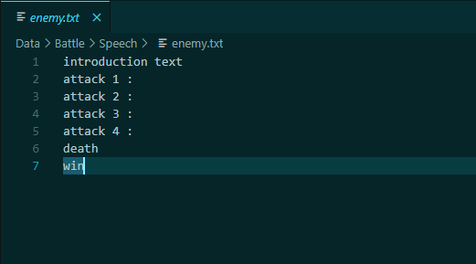
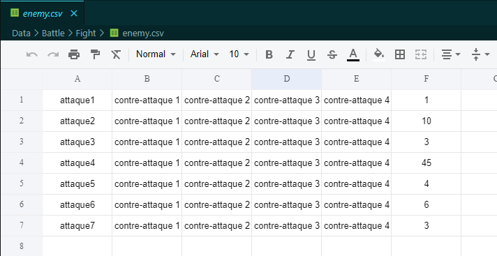

# Rapport PokeHES

## 1 Introduction

Dans le cadre du cours informatique 1, nous avons créé un jeu à partir de la bibliothèque GDX2D. Le nôtre se base sur Pokémon. Dans les grandes lignes, Le joueur dois se déplacer dans une carte en 2D, et trouver des ennemis qu’il doit combattre.

## 2 Cahier des charges

### 2.1 But

L’objectif de ce projet est de réaliser un jeu du style des premières versions de Pokémon. Les graphismes seront très simples et rétros. Les commandes seront avec seulement quelques touches comme pour les Gameboys de premières générations. Le but du jeu sera de récolter un maximum d’expérience (XP) durant un temps imparti.

### 2.2 Affichage

2 types d’affichage seront utilisé. L’un dit « map » pour le déplacement du joueur et l’autre dit « combat » pour les interactions avec les divers ennemis. L’affichage sera centré sur le joueur, sauf lors de l’atteinte des bordures de la map où le joueur se déplacera afin de garder un affichage entier. Le changement de map s’opère comme dans Pokémon par un passage comme une porte ou tout autre élément semblable. Tous les affichages seront en noir et blanc avec des textures simples comme sur la Figure 1. L’affichage combat sera quant à lui composé d’une partie fixe avec le joueur et l’ennemi ainsi qu’une boîte de dialogue dans la partie basse. (cf Figure 2). Le combat en lui-même mettra en avant des barres de points de vie comme sur la Figure 3

### 2.3 Combat

Les combats mettront en scène le joueur et un ennemi. La barre de points de vie du joueur représente le temps restant sur toute la partie. Celle de l’ennemi représente le nombre d’XP que le joueur peut gagner en le battant. Si le joueur perd le duel, un certain temps doit être attendu avant de pouvoir l’affronter à nouveau.

### 2.4 Options

Si le temp nous le permet, nous souhaiterions rajouter quelques options parmi les suivantes :

- Jouabilité avec une manette
- Mode multijoueur (sur même appareil ou en réseau)
- Portage Android
- Multilingue (DE, EN)
- Affichage couleur
- Sauvegarde des données par un nom d’utilisateurs
- Bouton de partage du score obtenu

## 3 Développement

### 3.1 Gameplay

Le gameplay de ce jeu se référence à une course contre la montre. Le joueur doit obtenir un maximum de points dans le temps imparti en affrontant les ennemis. Le temps est le nombre de point de vie qui lui reste que nous avons fixé à 900 secondes, soit 15 minutes.

Il doit explorer une grande carte qui se trouve être une partie des bâtiments de la HES-SO de Sion et utiliser les flèches de son clavier pour s’y déplacer. Ensuite, il doit trouver ses ennemis qui sont les professeurs et les combattre.

Ces affrontements se feront se la forme d’un quiz dans lequel le professeur le teste. Chaque question vaut un certain nombre de points et lorsque que le joueur répond juste, il gagne des points et fait descendre la barre de vie du professeur qui représente le nombre de crédit de la branche. Une fois qu’il n’en possède plus, il n’est plus accessible par le joueur. Mais s’il lui en reste alors le joueur doit attendre un certain temps (30s) pour revenir le combattre et doit trouver d’autres ennemis.

Le jeu se termine une fois le temps écoulé ou lorsque le joueur a obtenu les 6000 points (60 crédits) pour gagner la partie.

### 3.2 Implémentation générale

Le jeu a été conçu pour de façon ouverte afin pouvoir facilement y ajouter de nombreuses fonctionnalités. Le joueur est par exemple instancié dans son propre ScreenPlayer car il y a un écran par joueur. Si un deuxième joueur est ajouté, il aura sa propre instance de ScreenPlayer et aura son et ses propres contrôleurs. Les ennemis ont tous leur propre instance mais sont partagé dans le jeu entre tous les joueurs. Si un joueur à vaincu un ennemi, celui-ci devient dès lors inaccessible pour tous
Avec la conception du jeu actuel il est aussi extrêmement aisé d’ajouter du contenu. Une seule ligne de code par carte ou par ennemi est nécessaire. Tout le reste n’est que la base de données dans data.

### 3.3 Partie « main »

Le package « main » contient la class principal « PokeHES » ainsi que la class statique des paramètres.  La class « PokeHES » est une classe très importante en plus d’être la class principale.
Elle coordonne les différents éléments du jeu et fait que le jeu a une structure. La partie principale peut être découpée en 3 parties :

#### 3.3.1 Map

Cette partie fait exécute la gestion du joueur sur la map pour le déplacement (Figure 4).
Elle vérifie aussi les conditions pour pouvoir passer à l’affichage battle. Pour ceci, le joueur doit aller contre un ennemi et ce dernier doit encore avoir des points de vie et s’être suffisamment reposé (Figure 5).
Si ces conditions sont remplies, le changement d’écran s’opère pour aller en mode « battle »

#### 3.3.2 Battle

Cette partie exécute la commande de gestion du mode de combat, ajoute les xps au joueur et enlève les pvs à l’ennemi en fonction du monde de combat décrit plus bas.
Elle vérifie aussi si le combat est encore en cours et si celui-ci est terminé, le changement d’écran s’opère pour aller au mode « map ».

#### 3.3.3 End game

Si le jeu est terminé (joueur qui a toute son xp ou plus de pv), un changement d’écran s’opère pour passer sur l’écran de fin de jeu. En fonction de l’xp du joueur, le texte de victoire ou de défaire s’affichera.

#### 3.3.4 Autre

La partie « main » contient aussi quelques autres éléments secondaires :

- Initialisation du joueur et de tous les ennemis
- Initialisation des différentes classes du jeu
- Gestion du temps
- Gestion de l’affichage de toutes les entités
- Gestion des appuis de touches

### 3.4 Partie carte

#### 3.4.1 Création des cartes

Toutes les cartes ont été réalisée avec des pack de texture libre (min. AGPL3) sur Tiled. Pour se simplifier la vie et travailler avec des petits packs de texture, un petit programme en python pour ne sélectionner que quelques tiles du pack existant (contenant parfois plus de 5000 textures) et créer un nouveau pack de texture.
Les cartes contiennent plusieurs calques (Figure 8) qui définissent la carte final (Figure 6 et Figure 7). Pour passer d’une carte à une autre, des objet « door » sont placé sur la carte. Ils possèdent les propriétés pour la prochaine carte (Figure 9). Les portes qui emmènent vers une salle avec un ennemi sont indiqué avec une petite pokéball à l’entrée (Figure 7).

Un total de 17 cartes a été réalisé pour le rendu du projet.

#### 3.4.2 Gestion des cartes

La gestion des cartes se passe dans la classe « ScreenMap ». Cette classe contient de nombreuse méthode pour gérer la progression du joueur au travers des cartes ainsi que pour l’affichage de ces cartes.

Le plus gros challenge a été de pouvoir gérer ces nombreuses cartes qui contiennent toutes plusieurs calques.
Les cartes sont d’abord chargées et mappées avec leur nom lors de l’initialisation.
Ensuite la carte où se situe le joueur est analysé à chaque frame pour l’affichage et pour le déplacement du joueur. Les calques sont enregistrés dans un vecteur pour que la classe du joueur analyse tous les calques pour savoir s’il est possible d’avancer ou pas.
Si la case suivante est praticable, les opérations standard comme récupérer la vitesse, déplacer le personnage, faire l’animation, … s’opère.

Un calque spécial contient les portes et la méthode « isDoor » analyse si une porte de la carte en cours se trouve à la même position.

### 3.5 Partie combat

Durant la partie combat, le joueur se retrouve face à l’ennemi et dois répondre à son quiz jusqu’à ce que son adversaire n’ait plus de point de vie.

Au début, la partie commence avec un mot d’introduction (gauche), puis, l’ennemi pose 4 questions aléatoires (centre) et le joueur peut gagner des points. A la fin du combat, l’adversaire, dit un texte pour terminer (droite).

#### 3.5.1 La gestion de la base de données, du texte

Pour gérer la base de données, nous avons chaque fois donné le nom du professeur aux fichiers. Il existe un pour le texte, un pour les questions et un pour les images. Ils sont classés dans plusieurs dossiers différents.

Ensuite, nous avons gérer le texte de la manière suivante :
Nous utilisons une class « SpeechData » qui va répertorier tous les textes de sur plusieurs lignes. Cette partie du programme va ouvrir le fichier .txt et mettre dans un vecteur de String tous les textes qui se présentent de la manière suivante :

Le fichier comporte les paroles d’introduction du personnage, les introductions aux différentes attaques et un mot de fin différent, si le joueur l’a battu ou non.

Nous exploitons aussi une deuxième class « FightData » qui va se charger de lister les réponses dans un vecteur de class « Attack » qui se présente de cette manière :

Cette class va permettre de stocker les questions, les 4 réponses et le nombre de point de la question que l’on reçoit si on répond juste du fichier. Donc « FightData » va récupérer les données dans le .csv avec le nom de l’ennemi de cette forme :

Ce fichier contient l’attaque, les 4 contre-attaques et les points d’expérience pour chaque question.

Finalement, tout est amené dans la class « TextEnemy », où le texte est produit en entier. Elle va créer un vecteur de class « Line » pour stocker le texte de l’ennemi et s’il est en mode attaque :

Le deuxième attribut « attackOn » sert à détecter si l’ennemi est en train de poser les questions pour que le joueur ne puisse qu’utiliser les touches 1, 2, 3, et 4 de son clavier pour répondre. Chaque partie du texte du professeur est stocker dans le premier attribut « line ». Il contient à chaque fois le mixe entre le « SpeechData » et le « FightData ». Cela se présente de la manière suivante dans le vecteur :

- 0. Le texte d’introduction
- 1. La partie « attack1 » de « SpeechData », la question 1, les 4 réponses et les points
- 2. La partie « attack2 » de « SpeechData », la question 1, les 4 réponses et les points
- 3. La partie « attack3 » de « SpeechData », la question 1, les 4 réponses et les points
- 4. La partie « attack4 » de « SpeechData », la question 1, les 4 réponses et les points
- 5. Le texte si le joueur a réussi à combattre le professeur
- 6. Le texte si le joueur n’a pas encore réussi à gagner le professeur

Une fois tout cela terminer, le texte est affiché dans la boîte de dialogue en dessous de la partie.

#### 3.5.2 L’aléatoire des questions

Chaque question posée par l’ennemi est posée de façon aléatoire et chaque réponse que peut sélectionner le joueur est aussi mélangée de façon aléatoire. Pour faire cela, nous avons créé une méthode que retourne un tableau contenant le nombre de numéro aléatoire souhaité compris entre les bornes minimum et maximum. Le tout est gérer dans la class « TextEnemy » où on retrouve cette méthode :

Pour commencer, on entre un minimum, un maximum et les nombres de chiffres aléatoires choisis. La méthode crée un premier tableau contenant tous les numéros entre les paramètres y compris. Elle génère un second tableau vide, mais pouvant contenir le nombre de nombres que l’on veut. Ensuite, elle crée une nouvelle instance de class « Random » pour générer un nombre aléatoire et passer à tous les éléments du premier tableau et les changer de place avec un autre de position aléatoire.
Finalement, Nous prenons les 4 premiers éléments du tableau mélangé pour le mettre dans le deuxième tableau qui permet à la méthode de retourne celui-là.

Ainsi, nous utiliser cette méthode pour mélanger les questions de chaque ennemi et prendre 4 d’entre elles. Mais aussi pour mélanger les 4 réponses que le joueur peut choisir.

### 3.5.3 Le changement de question

Dans l’affichage du combat, le texte de l’ennemi défile avec les touches. Cette partie est gérée dans les class « Battle » et « ScreenBattle ».
Tout d’abords, il a fallu différencier les touches lorsque le joueur répond à une question ou lit du texte du professeur. Nous avons utilisé un attribut « attackOn » dans le vecteur de class « Line » comme expliqué plus haut. Ainsi, lorsque le joueur appuie sur les touches 1, 2, 3, 4 pour répondre à une question, ou lorsqu’il appuie sur la barre espace. Nous pouvons appeler la méthode « action » de la class « Battle ».

C’est méthode nous permet de déterminer quelle action nous faisons en fonction d’une variable « LineSpeech » que nous obtenons à l’aide de « getLineSpeech ». Cet attribut de la class « Battle » détermine quel élément du vecteur de class « Line », nous affichons.
Les différents cas étudiés :

- 1. Si « lineSpeech == 4 » : cela veut dire que le joueur se trouve à la dernière question. Alors, nous affichons le mot de fin avec la méthode « finishSpeech ».
- 2. Si « lineSpeech == 5 || lineSpeech == 6 » : cela veut dire que le joueur se trouve au mot de fin. Alors, nous quittons la partie de combat pour retourner sur la carte avec la méthode « finish ».
- 3. Si « 0 < lineSpeech || lineSpeech < 4 » : cela veut dire que le joueur se trouve aux questions de l’ennemi. Alors, il faut contrôler la réponse du joueur avec la méthode « checkAnswer » qui prend comme argument. Par contre si après cette action, les points de vie de l’ennemi sont à 0, on affiche le mot de fin.
- 4. Le cas par défaut, on appelle la méthode « readNextLine » qui incrémente « lineSpeech » de 1 pour afficher la ligne suivante.

### 3.6 Fin de partie

La fin de partie intervient dans deux cas différents :

1. Le joueur a atteint le nombre de crédit maximum pour terminer le jeu et le message suivant affiche le nombre de crédit atteint et le temps que le joueur a pris.

2. Le temps s’est écoulé et le joueur a perdu la partie et le message suivant affiche le nombre de crédit qu’il a obtenu.

## 4 Les améliorations

- Ajouter des questions supplémentaires
- Ajouter des ennemis supplémentaires
- Ajouter une manière d’obtenir du temps supplémentaire
- Actions cachées (Easter eggs)
- Interface graphique
Mode de jeu :
- Ajouter un mode multijoueur sur serveur
- Sauvegarde des anciennes parties
- Mode deux joueurs sur un ordinateur
- Multilingue
- Mode Android
Code :
- Enlever les solutions bouts de scotch

## 5 Conclusion

Le jeu utilise des solutions bouts de scotchs pour faire fonctionner le jeu. Mais à terme, ce n’est pas une solution viable pour continuer à implémenter de nouvelle fonctionnalité. Il faudrait modifier la librairie GDX2D pour simplifier certaine chose, par exemple la class « RenderingScreen ».

Malgré un jeu très ambitieux et les difficulté rencontrées (décrites plus haut), nous avons un parfaitement fonctionnel. Le cahier des charges est entièrement respecté il ne manque que les options citées dans ce dernier et du contenu qui est très facile à intégrer vu notre conception du jeu.
